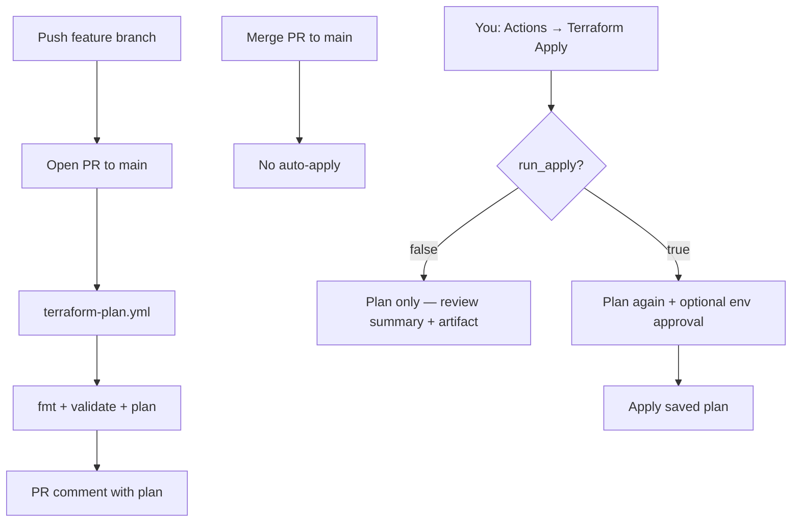

# GitHub Actions — Terraform CI/CD

Plan automatically on pull requests. **Apply is always manual** — nothing deploys when you merge to `main`.

Uses **OIDC** to AWS (no long-lived access keys in GitHub).

---

## Do you need a paid GitHub plan?

| Repo type | GitHub Actions minutes | Manual apply (this setup) | Environment approval gate |
|-----------|----------------------|---------------------------|---------------------------|
| **Public** | Free, unlimited | Free | Free (optional reviewers) |
| **Private (Free)** | 2,000 min/month | Free | `run_apply` checkbox only* |
| **Private (Pro)** | 3,000 min/month | Free | + optional reviewer approval |

\*On **private Free**, GitHub Environment “required reviewers” is a paid feature. You still get full control via the two-step **`run_apply`** flow below (no paid plan required).

**Typical usage for this repo:** a few minutes per plan/apply run — well within Free tier limits.

**AWS cost:** GitHub Actions does not create AWS resources by itself. You pay AWS only when you manually run **Terraform Apply** with `run_apply = true`.

---

## How it works (events)



| Event | Workflow | What happens |
|-------|----------|----------------|
| **PR opened/updated** → `main` | `terraform-plan.yml` | Plan prod + dev; comment plan on PR |
| **Push/merge to `main`** | *(none)* | **No apply** |
| **Manual: Terraform Plan** | `terraform-plan.yml` | Plan one environment |
| **Manual: Terraform Apply** (`run_apply=false`) | `terraform-apply.yml` | Plan only — review before applying |
| **Manual: Terraform Apply** (`run_apply=true`) | `terraform-apply.yml` | Plan → you confirm → apply exact plan |

---

## Enable on your repo (checklist)

### Phase 1 — AWS (one-time, local terminal)

1. **Install** Terraform ≥ 1.8 and AWS CLI; run `aws configure` or SSO login.

2. **Bootstrap remote state** (if not done):

   ```bash
   cd bootstrap
   cp terraform.tfvars.example terraform.tfvars
   ```

3. **Edit `bootstrap/terraform.tfvars`:**

   ```hcl
   enable_github_actions       = true
   github_repository           = "gvsharma/gamya-couture-infra"
   create_github_oidc_provider = true
   ```

4. **Apply bootstrap:**

   ```bash
   terraform init && terraform apply
   terraform output -raw github_terraform_role_arn
   ```

   Save the ARN (starts with `arn:aws:iam::...`).

---

### Phase 2 — GitHub repository settings

Open: `https://github.com/gvsharma/gamya-couture-infra/settings`

#### A. Actions variable (required)

**Settings → Secrets and variables → Actions → Variables → New repository variable**

| Name | Value |
|------|--------|
| `AWS_TERRAFORM_ROLE_ARN` | ARN from bootstrap output |

#### B. Enable Actions (if disabled)

**Settings → Actions → General**

- Allow actions: **Allow all actions** (or allow reusable workflows)
- Workflow permissions: **Read and write** (needed for PR plan comments)

#### C. Branch protection (recommended)

**Settings → Branches → Add rule** for `main`:

- Require pull request before merging
- (Optional) Require status check: **Terraform Plan / Plan (prod)**

#### D. Environments (optional — Pro/public repos)

**Settings → Environments**

| Name | Used for | Suggested protection |
|------|----------|----------------------|
| `production` | prod apply | Required reviewers: you |
| `development` | dev apply | None |

On **private Free**, skip reviewers — use the `run_apply` two-step flow instead.

#### E. Push workflow files

Merge the branch containing `.github/workflows/` to `main` (or push directly if you are the only contributor).

#### F. Optional variable when domain is ready

**Variables →** `TF_VAR_domain_name` = `gamyacouture.com`

---

## Day-to-day workflow

### 1. Change infrastructure code

```bash
git checkout -b feature/my-change
# edit .tf files
git push -u origin feature/my-change
```

Open a **PR to `main`** → wait for **Terraform Plan** → read the PR comment or job summary.

### 2. Merge PR

Merging **does not apply** anything to AWS.

### 3. Apply when you are ready (two steps)

**Step A — Plan only (review)**

1. **Actions → Terraform Apply → Run workflow**
2. Branch: `main`
3. Environment: `prod` (or `dev`)
4. **Run apply after plan:** `false`
5. Run workflow
6. Open the **Plan** job → **Summary** tab (or download artifact `plan.txt`)

**Step B — Apply (your confirmation)**

1. **Actions → Terraform Apply → Run workflow** again
2. Same branch and environment
3. **Run apply after plan:** `true` ← your explicit confirmation
4. If using Environments with reviewers: approve the deployment when prompted
5. **Apply** job runs `terraform apply` using the plan from the same workflow run

> The apply job uses the plan file generated seconds earlier in the same run — not a stale plan from a previous day.

---

## Files reference

| File | Role |
|------|------|
| `environments/prod/ci.tfvars` | Non-secret prod defaults for CI |
| `environments/dev/ci.tfvars` | Non-secret dev defaults for CI |
| `terraform.tfvars` | Local overrides (gitignored) |
| `bootstrap/examples/backend.*.hcl` | Remote state config for init |

---

## Troubleshooting

| Problem | Fix |
|---------|-----|
| `Could not assume role with OIDC` | Check `AWS_TERRAFORM_ROLE_ARN` and `github_repository` in bootstrap match this repo |
| Plan works locally, fails in CI | Commit `.terraform.lock.hcl` after `terraform init` locally |
| Apply job skipped | You left `run_apply` as `false` — re-run with `true` |
| Waiting for approval | **Actions** run page → **Review deployments** → Approve (if Environments configured) |
| State lock error | Another apply in progress; wait or clear stale DynamoDB lock row |

---

## Security summary

- No AWS access keys in GitHub
- Merge to `main` never applies
- Apply requires manual workflow + `run_apply=true`
- Optional second gate: Environment required reviewers (Pro/public)
- Bootstrap is not run from CI
