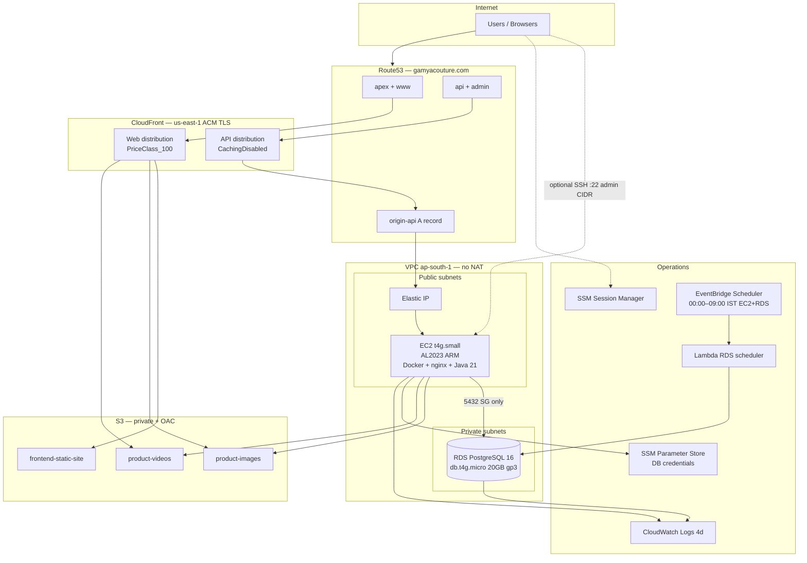
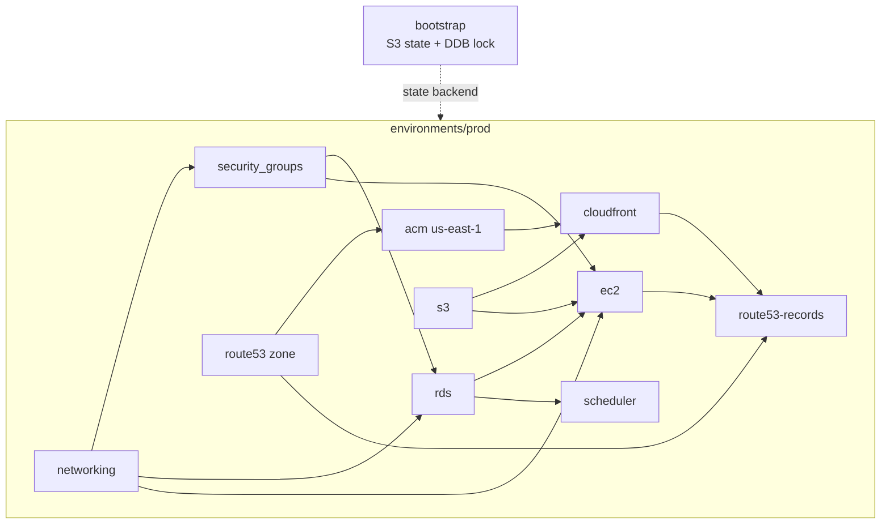

# Gamya Couture Infrastructure Review

Review of `gamya-couture-infra` against MVP constraints and production goals. **Verdict:** The design fits a **≤ ₹3,000/month** boutique MVP if you run **prod only**, keep the RDS schedule, and avoid a full **dev** stack in parallel.

---

## Hard constraints check

| Constraint | Status | Evidence |
|------------|--------|----------|
| No NAT Gateway | **Pass** | `modules/networking` — public EC2 + private RDS only |
| No ECS / EKS | **Pass** | Docker on single EC2 |
| No ALB | **Pass** | Route53 → CloudFront → EC2 |
| No Aurora | **Pass** | `aws_db_instance` PostgreSQL 16, `db.t4g.micro` |
| Under ₹3,000/month | **Pass (prod, with caveats)** | See cost table below; **dev + prod doubles spend** |

---

## 1. Architecture diagram



### Traffic paths

| Path | Flow |
|------|------|
| Storefront | `www` / apex → **Web CF** → S3 (`/`, `/images/*`, `/videos/*`) |
| API / Admin | `api` / `admin` → **API CF** (HTTPS) → `origin-api.*` (HTTP:80) → **EC2** → Spring Boot |
| Database | EC2 → RDS private IP only |
| Media upload | EC2 IAM → S3 images/videos (not via CloudFront) |

---

## 2. Deployment order

### One-time

| Step | Path | Purpose |
|------|------|---------|
| 1 | `bootstrap/` | S3 state bucket + DynamoDB lock |
| 2 | Configure `environments/prod/backend.hcl` | Remote state |
| 3 | Registrar NS | Point to `route53` name servers |

### Per environment (`environments/prod`)

| Step | Modules / resources | Notes |
|------|---------------------|--------|
| 1 | `networking` | VPC, subnets, IGW |
| 2 | `security-groups` | Needs `admin_cidr` in tfvars |
| 3 | `route53` | Hosted zone |
| 4 | `acm` (us-east-1) | Wait for DNS validation |
| 5 | `s3` | Buckets + lifecycle |
| 6 | `rds` | DB + SSM secrets |
| 7 | `ec2` | App host + EIP |
| 8 | `cloudfront` | Web + API distributions (needs ACM ARN) |
| 9 | `route53-records` | Aliases (needs CF + EC2 IP) |
| 10 | `scheduler` | RDS stop/start cron |
| 11 | App deploy | `aws s3 sync` → frontend bucket; Docker on EC2; CF invalidation |

**Terraform apply** can be one `terraform apply` in prod (graph orders modules). **Operational** order matters for ACM (validation before custom-domain CloudFront) and DNS (NS at registrar).

### Suggested first-time CLI sequence

```bash
cd bootstrap && terraform apply
cd ../environments/prod
cp terraform.tfvars.example terraform.tfvars   # admin_cidr, etc.
terraform init -backend-config=../../bootstrap/examples/backend.prod.hcl
terraform apply -target=module.networking -target=module.security_groups -target=module.route53
terraform apply -target=module.acm
terraform apply   # remainder
```

---

## 3. Estimated monthly cost (prod only, ap-south-1)

Approximate **USD**; multiply by ~₹83 for INR.

| Service | Config | ~USD/mo |
|---------|--------|---------|
| EC2 | `t4g.small` 24/7 | 13.00 |
| EBS | 30 GB gp3 | 2.40 |
| Elastic IP | Attached | 0.00 |
| RDS compute | `db.t4g.micro`, ~17 h/day (scheduler) | 9.00 |
| RDS storage | 20 GB gp3 | 2.30 |
| CloudFront | 2 distributions, ~500 hits/day | 1.50 |
| S3 | Static + media (low GB) | 1.50 |
| Route53 | 1 hosted zone | 0.50 |
| CloudWatch Logs | 4-day retention, several groups | 1.50 |
| Lambda + Scheduler | 2 invocations/day | 0.10 |
| ACM | Public cert | 0.00 |
| SSM parameters | Standard | 0.00 |
| Terraform state S3 + DDB | Minimal | 0.50 |
| **Total** | | **~32 USD ≈ ₹2,650** |

### Budget headroom

~₹350 for data-transfer spikes or brief RDS 24/7 before scheduler works.

### Over-budget risks

| Risk | Impact |
|------|--------|
| Full **dev** environment (EC2 + RDS + CF) | +₹2,000+ |
| RDS **without** schedule 24/7 | +₹300–400 |
| Large video storage / egress | Variable |
| Upgrading EC2 to `t4g.medium` | +₹800+ |

---

## 4. Security risks

| Severity | Risk | Detail |
|----------|------|--------|
| **High** | **Direct-to-origin bypass** | `origin-api.gamyacouture.com` → EIP; SG allows **0.0.0.0/0:80/443** on EC2. Attackers can skip CloudFront (no WAF, no rate limit). |
| **High** | **No RDS backups** | `backup_retention_period = 0`, `skip_final_snapshot = true` — accidental delete or corruption = data loss. |
| **Medium** | **Admin = API origin** | Same CloudFront distribution and EC2/nginx for `api` and `admin`; weak blast-radius separation. |
| **Medium** | **DB password in Terraform state** | `random_password` + RDS password in state; anyone with state read sees secrets. |
| **Medium** | **SSH exposed** | Port 22 from `admin_cidr`; misconfigured `/32` or stale IP increases exposure. Prefer SSM-only. |
| **Medium** | **No WAF / rate limiting** | CloudFront only; common for DDoS/application abuse on API. |
| **Low** | **HTTP origin CF → EC2** | Acceptable for CF custom origin; ensure nginx only trusts `Host` / restrict origin to CF IP ranges (not implemented). |
| **Low** | **Single EC2 AZ** | One public subnet used; AZ outage = full API outage. |
| **Low** | **No monitoring alarms** | `modules/monitoring` not implemented; failures may go unnoticed. |

### What’s done well

- RDS private, not publicly accessible
- RDS SG: 5432 from EC2 SG only
- S3 blocked public; OAC + bucket policies scoped to distribution ARN
- IMDSv2 required on EC2
- SSM core policy on EC2
- TLS at CloudFront (ACM, TLS 1.2+)
- Encrypted EBS + RDS storage
- Least-privilege IAM for SSM params, S3 media, RDS scheduler

---

## 5. Recommended improvements

### Priority 1 (security + prod readiness)

1. **Lock down EC2 ingress** — Allow **80/443 only from CloudFront** (managed prefix list or CloudFront origin-facing IPs) + remove public access to EIP for app ports; keep SSM for ops.
2. **Enable RDS backups** — `backup_retention_period = 7` (accept ~₹150–200/mo) or nightly `pg_dump` to S3 (cheaper, more ops).
3. **Add `modules/monitoring`** — EC2 status, RDS CPU/storage, CloudFront 5xx, billing alarm at ₹2,500.
4. **Secrets** — Move DB password to `aws_secretsmanager_secret` with rotation later; reduce state sensitivity.

### Priority 2 (cost + maintainability)

5. **Restrict SG when using CF-only API** — Drop 0.0.0.0/0 on 80/443 after prefix-list rules.
6. **Single CloudFront** — Optional: merge API/web behind one distribution + CF Function routing (saves a distribution, slightly more complex).
7. **CI deploy role** — IAM user/OIDC for `s3 sync` + invalidation (not EC2 instance role).
8. **`terraform.tfvars` validation** — `validation` blocks for `admin_cidr` requiring `/32`.

### Priority 3 (later scale)

9. **WAF** on API/web CF (extra cost).
10. **Multi-AZ RDS** or read replica (budget break).
11. **Private EC2 + NAT** only if compliance requires (violates current cost model).
12. **Parameterize nginx `server_name`** in EC2 user-data from Terraform variables.

---

## 6. Terraform dependency graph



### Module-level edges (prod `main.tf`)

| Module | Depends on |
|--------|------------|
| `security_groups` | `networking` |
| `acm` | `route53` |
| `rds` | `networking`, `security_groups` |
| `ec2` | `networking`, `security_groups`, `rds` (IAM), `s3` (IAM) |
| `cloudfront` | `s3`, `acm` |
| `route53-records` | `route53`, `cloudfront`, `ec2` |
| `scheduler` | `rds` |

**Cycle avoidance:** `route53-records` is a separate module so `route53` → `acm` → `cloudfront` → `route53-records` does not create a Terraform module cycle.

---

## Terraform best practices assessment

| Practice | Rating | Notes |
|----------|--------|-------|
| Modular layout | **Good** | Clear `modules/*`, thin `environments/prod` |
| Provider versioning | **Good** | `>= 1.8`, AWS `~> 5.0` |
| Tagging | **Good** | `default_tags` via `global/tags` |
| State | **Good** | Bootstrap S3 + lock; env uses partial backend |
| Secrets | **Fair** | SSM for runtime; password still in state |
| IAM least privilege | **Good** | Scoped policies per module |
| Documentation | **Good** | README per module |
| CI/CD hooks | **Missing** | No GitHub Actions / OIDC |
| Tests | **Missing** | No `terraform validate` in CI, no `checkov` |
| Monitoring as code | **Missing** | Phase 10 not built |
| Hardcoded hostnames | **Fair** | `user-data.sh` has `gamyacouture.com` literals |

---

## Production readiness summary

| Area | Score | Comment |
|------|-------|---------|
| Cost optimization | **8/10** | Strong; scheduler + no NAT/ALB; watch `t4g.small` + dual CF |
| Security | **6/10** | Good data layer; weak edge/origin hardening |
| Production readiness | **6/10** | No backups, no alarms, single-AZ |
| Terraform quality | **8/10** | Solid structure; finish monitoring + tighten SG |

**Overall:** Suitable for **MVP launch** with eyes open on backups and origin exposure. Address **origin bypass** and **RDS backups** before calling it “production-grade.”

---

*Generated for reference. Re-validate costs and architecture after major Terraform changes.*
